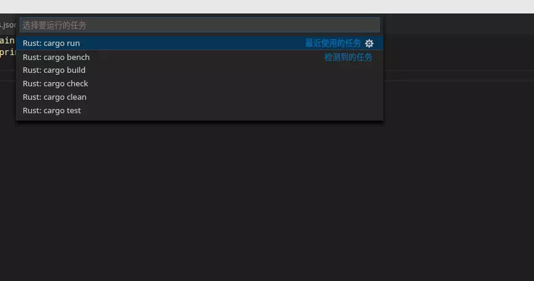

# vscode 中 rust 的开发环境

##　 1、安装 rls

> rustup update  
> rustup component add rls-preview rust-analysis rust-src  
> 此项目处于发展的起始阶段。在某些情况下，可能会出现 BUG；使用请谨慎。   
> RLS 提供了一个在后台运行的服务器，提供了 Rust 编程的相关信息，包括 IDE，编辑器和其它工具。它支持诸如“goto 定义”，符号搜索，重新格式化和代码完成等功能，并支持重命名和重构。

RLS 从编译器和 Racer 获取源数据。在可能的情况下，它使用来自编译器的精确而完整的数据。在某些情况下（例如代码实现，构建太慢），它使用 Racer。

由于 Rust 编译器不支持端到端增量编译，因此我们无法提供完美的体验。然而，通过优化我们对编译器的使用并回归到 Racer，我们可以为中小型的项目提供相当不错的体验。随着 RLS 和编译器的发展，我们将为越来越大的项目提供更好的体验。

RLS 设计为前端独立。我们希望它将被不同的编辑器和 IDE 广泛采用。为了快速开发，我们提供了 Visual Studio 代码的 RLS 前端的参考实现。

## 2、配置跳转到标准库

安装 racer

> cargo install racer
安装失败，尝试
> cargo +nightly install racer

## 3、配置环境变量

> export CARGO_HOME="~/.cargo/"
> export RUSTBINPATH="~/.cargo/bin"
> export RUST="~/.rustup/toolchains/stable-x86_64-unknown-linux-gnu"
> export RUST_SRC_PATH="$RUST/lib/rustlib/src/rust/src"
> export PATH=$PATH:\$RUSTBINPATH

## 4、配置 rust 插件

Ctrl+P and type ext install vscode-rust

如果你没有配置 toolchain, 太会在右下角提示你 install toolchain, 你点击 yes 即可，不过大约需要 1-3 分钟时间。安装完毕后

1、测试一下 Ctrl+Shift+i 是否能正常格式化代码，如果能格式化代码说明已经配置正常了。
2、测试一下是否能跳转到标准库
如下代码

```rust
let a = String::new();
```

Ctrl+鼠标右键点击（或者直接采用 F12）查看是否能进入该方法的实现处。

## 5、设置快捷键

自动检测 cargo 任务

